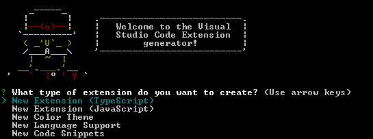
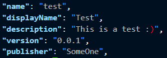
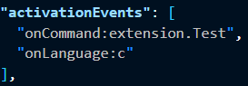
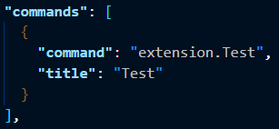
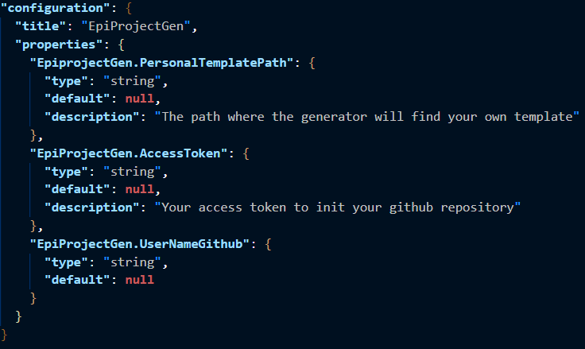

# Comment développer une extension VSCode

---

Bonjour et bienvenu dans ce workshop sur la thématique du développement d'extension sur **Visual Studio Code** _l'éditeur de code extensible, multi-platforme et open source_ développé par **Microsoft**.

Le but de ce workshop est d'apprendre à mettre en place l'environnement de développement d'une extension l'éditeur de code **Visual Studio Code**.
Nous allons évoquer les points suivants :

- [L'installation de VSCode](#Installation-de-VSCode)
- [Installation de Yeoman](#Installation-de-Yeoman)
- [Génèrer votre première extension](#Génèrer-votre-première-extension)
- [Développer une extension](#Développer-une-extension)
  - [Le package.json](#Le-package.json)
    - [Les information basique](#Les-information-basique)
    - [L'activation de l'extension](#L'activation-de-l'extension)
    - [Les contribute](#Les-contribute)
      - [Commandes](#Commandes)
      - [Configurations](#Configurations)
  - [Sujet de l'extension](#Sujet-de-l'extension)
- [npm](#npm)

---

## Installation de VSCode

Pour installer vscode sur votre machine nous vous conseillons de suivre ce [lien](https://code.visualstudio.com/download) qui mène directement au site officiel de l'éditeur qui vous aide pour installer leur outil, selon l'OS sur lequel vous vous trouvez.

---

## Installation de Yeoman

Yeoman est un générateur projet d'extension Typescript ou Javascript (je vous conseille le Typescript)

> npm install -g yo generator-code

---

## Génèrer votre première extension

> yo code

Cette commande vous ouvre sur une sélection.

Choisissez "New Extension (Typescript)" qui génère une extension **Hello World** prête à l'emploi.

Vous pouvez tester cette extension grâce au débogueur de VSCode (F5) qui vous ouvrira une nouvelle instance de VSCode avec l'extension intégrer.

**Ctrl + Maj + P** pour ouvrir le pannau de commande puis lancer la commande de l'extension en tapant "hello world".

Cette extension vous marque "Hello World" dans un encart en bas à droite.

---

## Développer une extension

### Le package.json

Je vous invite à ouvrir le fichier **package.json**. Il y a beaucoup d'informations mais, ne vous inquiétez pas c'est assez simple de prise en main en réalité.

Ce fichier ce décompose en trois parties.

#### Les information basique

Le nom de l'extension, la description, la version, etc.

#### L'activation de l'extension

Une extension peut s'activer de différentes manières. Avec une commande, par rapport à un langage, etc.

Pour plus d'information sur les [activation](https://code.visualstudio.com/api/references/activation-events).

#### Les contribute

##### Commandes

Le champ des commandes est en lien avec les activations de l'extension, car le nom que vous avez donné pour activer l'extension doit être le même que vous donnez pour la commande. Vous devais ajoutez un titre à cette commande, cela sert à activer l'extension dans le panneau de commandes.

##### Configurations

Ces champs servent à ajouter de la configuration à votre extension.

Pour plus d'informations sur [l'anatomie d'une extension](https://code.visualstudio.com/api/get-started/extension-anatomy).

### Sujet de l'extension

Je vous propose de faire une extension qui va créer l'arborescence d'un projet par rapport à une template. Vous devrez lui donner le choix entre plusieurs templates qui sont stockés dans le dossiers **Template**. Vous pouvez les modifier ou en ajouter à votre guise.

Tips : je vous conseille de vous renseigner sur les **showQuickPick** ;).

Si vous avez une question ou un problème n'hésitez pas à me demander.

---

## npm

l'utilisation de npm reste le même que pour un projet basique en Typescript ou Javascript.

---
